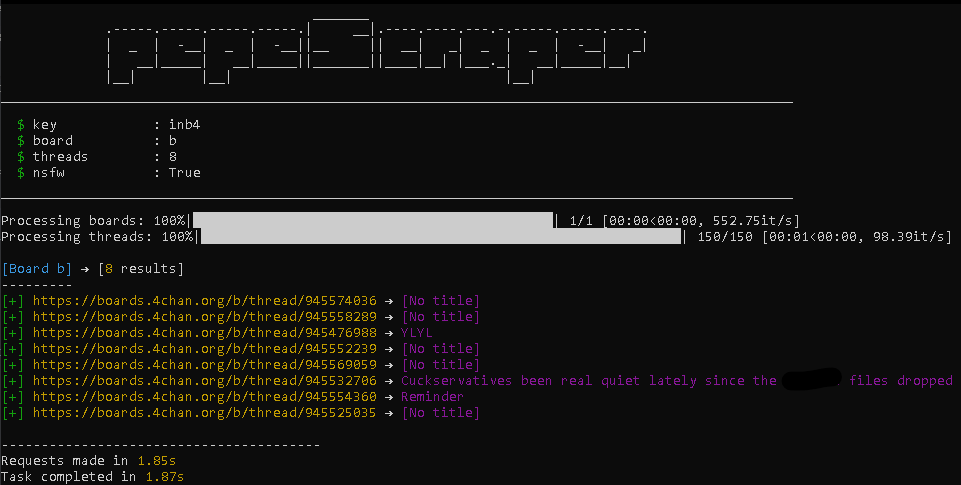

# pepeScraper - 4chan scraper  

*A complete scraper for 4chan (Now that's fast.)*

pepeScraper is a scraper that uses context for your searches and returns exactly what you want. *(I'm learning how to make an item look cooler than it actually is)*

- Enter keywords, anything you can think of *(just be careful what you search for 👀)*
- Control the results by date and exclude what you don't want to appear.
- Control the search speed of this program *(do not confuse the processing thread with the 4chan thread)*

## Table of contents

- [Installation](#installation)
- [Flags](#flags)
- [Privacy and data storage](#careful-with-nsfw-content)
- [Care](#careful-with-nsfw-content)

## Weird stuff

[](https://github.com/JuaanReis/pepeScraper) &nbsp;
[](https://github.com/JuaanReis/pepeScraper/pulls) &nbsp;
[](https://github.com/JuaanReis/pepeScraper/commits/main) &nbsp;
&nbsp;
[](LICENSE) &nbsp;
[](https://www.youtube.com/watch?v=dQw4w9WgXcQ) &nbsp;
[](https://www.youtube.com/watch?v=QwLvrnlfdNo)

## Installation

If you use Windows, just go to releases and download the latest version and then install the dependencies. *If you want to help and have access to the source code, use the code below.*

```bash
    git clone https://github.com/JuaanReis/pepeScraper.git
    cd ./pepeScraper
    pip install -r requirements.txt
    py main.py --help
```

## Flags

| Flag | Description | Example |
|-----|-----|-----|
| `--key <w>` | Keywords used as the base for search and scraping. | `--key mustang` |
| `--date <YYYY/MM/DD>` | Exact date when the OP post was made. | `--date 2024/01/10` |
| `--before <YYYY/MM/DD>` | Posts before the given date up to today. | `--before 2023/05/01` |
| `--after <YYYY/MM/DD>` | Posts after the given date up to today. | `--after 2024/02/01` |
| `--min-replies <n>` | Minimum number of replies the thread must have. | `--min-replies 10` |
| `--max-replies <n>` | Maximum number of replies the thread can have. | `--max-replies 200` |
| `--board <board_name>` | Name(s) of the board(s) to search. | `--board g` |
| `-T <n>` | Number of threads that the program will work with (changes speed, not the outcome). | `-T 9` |
| `--op-only`, `-op` | Only consider the original post (OP). | `-op` |
| `--no-op`, `-nop` | Opposite of `--op-only`, ignores the OP. | `-nop` |
| `--nsfw`, `-n` | Enable vulgar posts. | `-n` |
| `--nsfw-title`, `-nt` | Enable vulgar titles. | `-nt` |
| `--output`, `-o` | Save the results to a text file (links only). | `-o results.txt` |
| `--download_image`, `-di` | Download all images from the thread. | `-di` |
| `--log <w>` | Save logs in `pepescraper/src/data/logs`. | `--log scan.log` |
| `--all-boards`, `-ab` | Show all boards. | `-ab` |
| `--proxy`, `-p <w>` | Connect through a proxy. | `-p http://127.0.0.1:8080` |
| `--title`, `-t` | Apply the search term to the title. | `-t` |
| `--image`, `-i` | Filter the search by keyword in the image. | `-i` |
| `--language`, `-l` | Translate the output into the chosen language. | `-l pt` |

## Example



> I don't even know what this meme means (and fuck you if you do).

## Privacy and Data Storage

PepeScraper does NOT automatically store anything. <br>
it only uses the API and creates a direct link to 4chan. <br>
No logs, no history, no databases, no Facebook copy (maybe you understand). <br>
You have the option to save images of the boards, logs, and output results, but nothing is automatic 
(*unless you choose this option in the configuration file*)

*Everything is stored in RAM and deleted when the program finishes. (That's right, your mom won't find out what you searched for.)*

> Please don't sue me, I don't have the money to pay a lawyer. *(Sometimes there isn't even enough money to buy food.)*

## Careful with NSFW Content

> I'm serious, pornography can destroy your brain, your body, and your family (no matter how many times I write this, you'll ignore it).
'
```bash
    python main.py --keyword "pepe" --date 01/01/2025
```
*This can make your research perhaps safer (I don't know if I programmed this right).*

---
<br>
<samp>"Sometimes, longing for the past is due to a lack of money (or friends).<br>
Do something different from me, leave the house and go live."</samp>